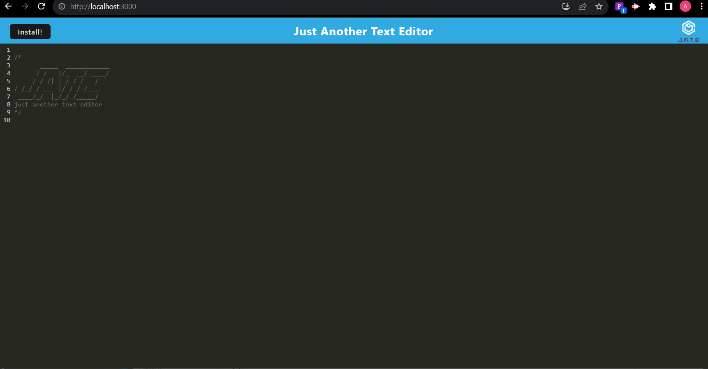

# ajspwa

Challenge 19,A text editor that runs in a browser

The purpose of building this code was to build a text editor that runs in the browser.  The app will be a single-page application that meets the PWA criteria.

I built this project because I may just in the future may want to start a blog on contact regarding coding or investing.  It would be beneficial for me to put it all information here. 

It solves my paper organization problem.  It helps with providing good information to people as well as 

I did work with a peer on this project.  Also with a tudor to get this to run properly.

Alot of this project came from code of a mini project and some code came from activities in the bootcamp.
I did work with a peer on this project.  I also worked with a TA to help get this running.

